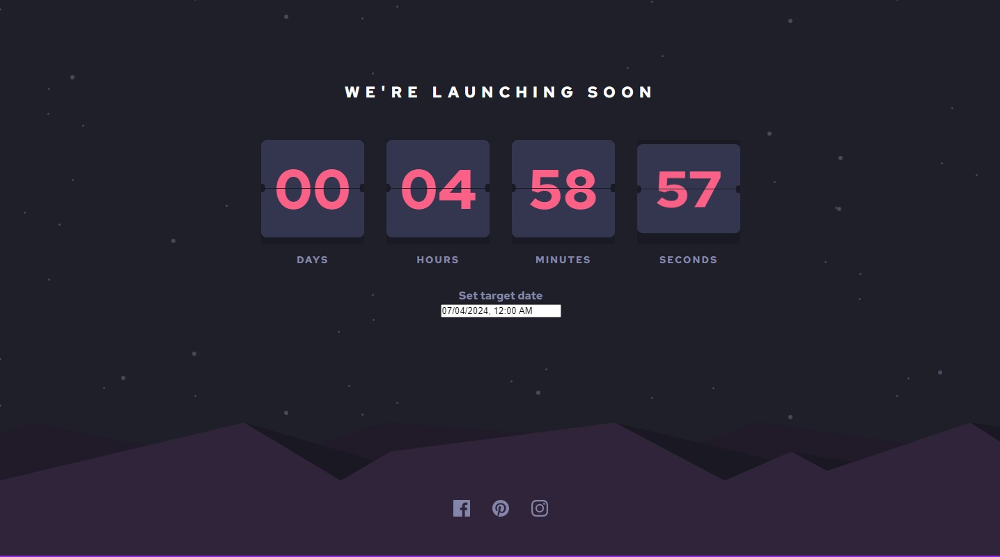

# Frontend Mentor - Launch countdown timer solution

This is a solution to the [Launch countdown timer challenge on Frontend Mentor](https://www.frontendmentor.io/challenges/launch-countdown-timer-N0XkGfyz-). Frontend Mentor challenges help you improve your coding skills by building realistic projects. 

## Table of contents

- [Overview](#overview)
  - [The challenge](#the-challenge)
  - [Screenshot](#screenshot)
  - [Links](#links)
- [My process](#my-process)
  - [Built with](#built-with)
  - [What I learned](#what-i-learned)
  - [Continued development](#continued-development)
  - [Useful resources](#useful-resources)
- [Author](#author)
- [Acknowledgments](#acknowledgments)


## Overview

### The challenge

Users should be able to:

- See hover states for all interactive elements on the page
- See a live countdown timer that ticks down every second (start the count at 14 days)
- **Bonus**: When a number changes, make the card flip from the middle ... **DONE**

### Extra added

- A "Target Date Selector" is added. So it can be a user input, instead of a hard-coded value. This utility makes the application much more useful.

### Screenshot




### Links


- Solution URL:  [Github repository](https://github.com/memominguez/launch-countdown)
- Live Site URL:  [Netlify](https://countdown-flipping.netlify.app)


## My process

### Built with

- Semantic HTML5 markup
- CSS custom properties
- Flexbox
- Mobile-first workflow
- [React](https://reactjs.org/) - JS library
- [React Datepicker](https://reactdatepicker.com/) - Third party library


### What I learned

Challenge: Flipping card when a number changes. Requires css styling and some programming.

```css
.flipcard {
  position: absolute;
  width: 70px;
  height: 66px;
  border-radius: 6px;
  transform-style: preserve-3d;
  transition: all 0.5s linear;
  background-color: var(--dark-desaturated-blue);
  cursor: pointer;
}

.flipcard__front {
  width: 100%;
  height: 100%;
  position: absolute;
  display: flex;
  justify-content: center;
  align-items: center;
  font-size: 36px;
  color: var(--soft-red);
  backface-visibility: hidden;
}
.flipcard__back {
  width: 100%;
  height: 100%;
  position: absolute;
  display: flex;
  justify-content: center;
  align-items: center;
  font-size: 36px;
  color: var(--soft-red);
  backface-visibility: hidden;
  transform: rotateX(180deg);
}
```
Flipping card programmatically

```js
 const [display, setDisplay] = useState("")
  const cardRef = useRef(null);

  useEffect(() => {    
      if (cardRef.current) {       
        if (count % 2 !== 0) {
          cardRef.current.style.transform = "rotateX(0deg)"; 
          const delay = setTimeout(() => {
              setDisplay(formatDigit(count))   
          }, 300)
          return () => clearTimeout(delay)
        } else {
          cardRef.current.style.transform = "rotateX(180deg)"; 
          const delay = setTimeout(() => {
              setDisplay(formatDigit(count)) 
          }, 300)
          return () => clearTimeout(delay)
        }
      }       
  
  }, [count]);
```


### Continued development


Continue improving my coding skills by developing challenging applications, like this one.


### Useful resources

- [Video tutorial](https://www.youtube.com/watch?v=OV8MVmtgmoY&t=283s) - Provided a flipping card example, with css.
- ChatGPT - Helped to solve how to manipulate css classes programmatically, by using the useRef hook.


## Author


- Website - [Guillermo Dominguez](https://gdominguez2024.vercel.app/)
- Frontend Mentor - [@memominguez](https://www.frontendmentor.io/profile/memominguez)


## Acknowledgments


Thanks to all those who share their knowledge, free of charge, through video tutorials in the youtube platform.
